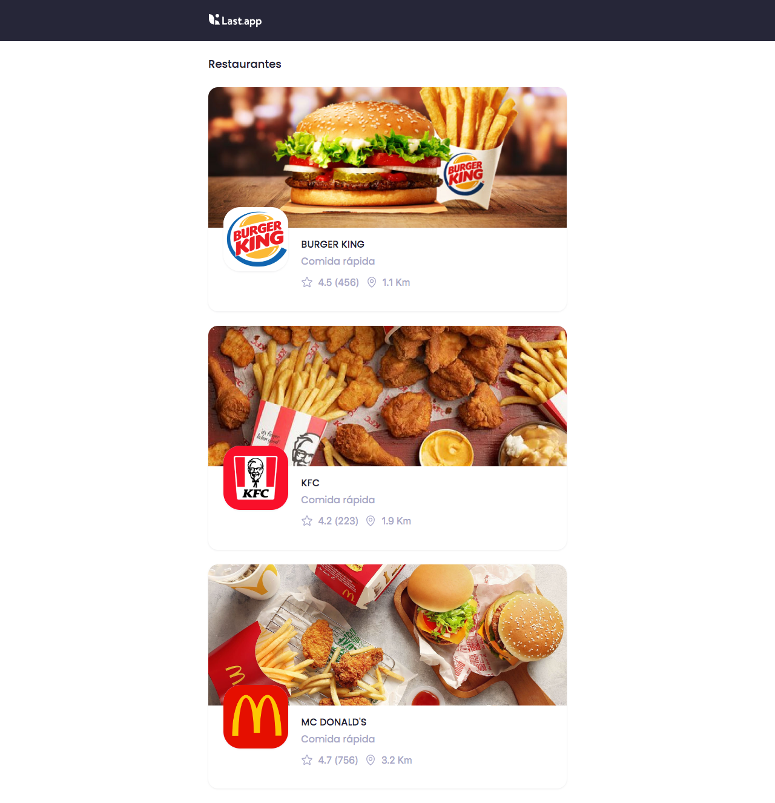
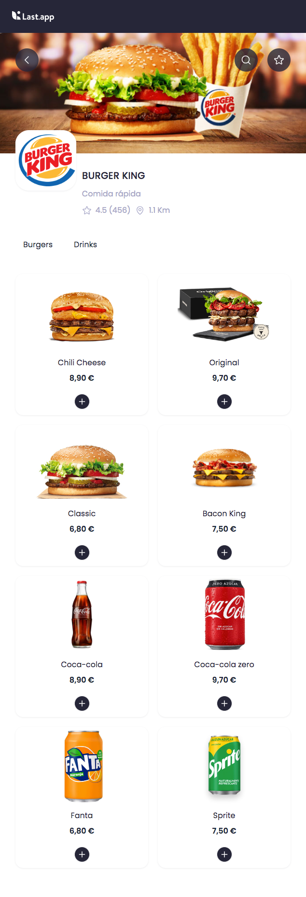
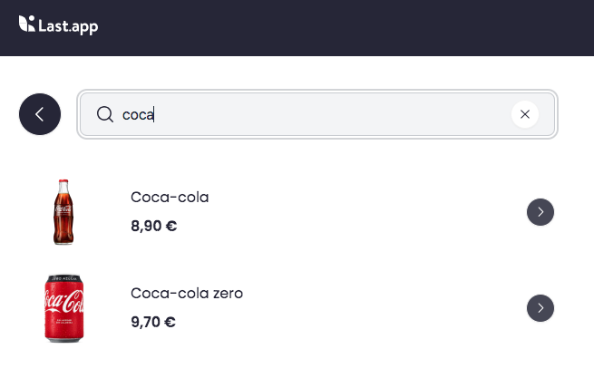

# Restaurant browser application

Assessment aimed at creating a simple mini app to check restaurant's menus/products nearby the user (Endpoints services were alreadey provided).

> [!NOTE]
>
> - ❤️ Feel free to add any improvements or suggestions you consider.

1. [Goals](#001)
2. [Tech Stack](#002)
3. [Installation and running the project](#003)
4. [Samples](#004)
5. [Next steps](#005)
6. [React + Typescript + Vite specs](#006)

<a name="001"></a>

### 🎯 Goals

- Display a list of restaurants. (Fetch those restaurants from an external service).
- Each restaurant's detail section should list the catalog of meals/products offered.
- Create a search section where users are able to filter out products offered by the restaurant.
- Being able of mock an order by selecting items from the restaurant section.

  #### Geolocation API:

  To implement the solution, we are required to use the [Geolocation API](https://developer.mozilla.org/en-US/docs/Web/API/Geolocation/getCurrentPosition), and also inform the user which restaurant is closer to its current position (geolocalization).

<a name="002"></a>

### Tech Stack

This conceptual test has been developed using the following technologies:

- **Front-end**
  - [React](https://react.dev/)
  - [TypeScript](https://www.typescriptlang.org/)
  - [Vite](https://vitejs.dev/)
  - [Tailwind CSS](https://tailwindcss.com/)
  - [DaisyUI](https://daisyui.com/)

<a name="003"></a>

### Installation and running the project

The project requires:

- [NodeJS](https://nodejs.org/)

**Clone the repository:**

```shell
git clone https://github.com/christianjtr/restaurant-browser-app.git
```

**Scripts:**

Before executing these scripts, you must run **npm install** in the directory you just downloaded/cloned the codebase. _Other scripts are in package.json file_.

```shell
# Start the development environment
> npm run dev

# Build the project in development mode
> npm run build

# Build the project in production mode
> npm run build:prod
```

<a name="004"></a>

### Samples

##### Live demo

Click on the following link [GitHub page project](https://christianjtr.github.io/restaurant-browser-app).

##### Preview

1. Restaurants section



2. Catalog section



3. Search products section



<a name="005"></a>

### Next steps

- Polish up interactions, UX, and responsiveness.
- Add unit tests, also e2e ones.

<a name="006"></a>

### React + TypeScript + Vite

> This specs were autogenerated by the framework.

This template provides a minimal setup to get React working in Vite with HMR and some ESLint rules.

Currently, two official plugins are available:

- [@vitejs/plugin-react](https://github.com/vitejs/vite-plugin-react/blob/main/packages/plugin-react/README.md) uses [Babel](https://babeljs.io/) for Fast Refresh
- [@vitejs/plugin-react-swc](https://github.com/vitejs/vite-plugin-react-swc) uses [SWC](https://swc.rs/) for Fast Refresh

#### Expanding the ESLint configuration

If you are developing a production application, we recommend updating the configuration to enable type aware lint rules:

- Configure the top-level `parserOptions` property like this:

```js
export default {
  // other rules...
  parserOptions: {
    ecmaVersion: 'latest',
    sourceType: 'module',
    project: ['./tsconfig.json', './tsconfig.node.json'],
    tsconfigRootDir: __dirname,
  },
};
```

- Replace `plugin:@typescript-eslint/recommended` to `plugin:@typescript-eslint/recommended-type-checked` or `plugin:@typescript-eslint/strict-type-checked`
- Optionally add `plugin:@typescript-eslint/stylistic-type-checked`
- Install [eslint-plugin-react](https://github.com/jsx-eslint/eslint-plugin-react) and add `plugin:react/recommended` & `plugin:react/jsx-runtime` to the `extends` list
